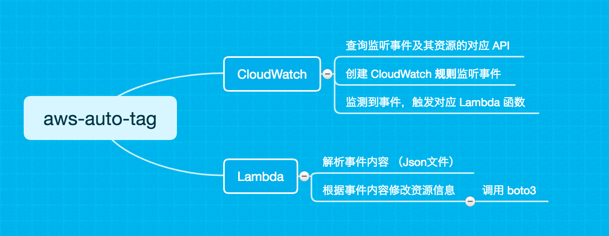

# AWSAutoTag

### 目的

当诸如 EC2、RDS、RedShift 等资源**状态发生改变**时（如新建，修改等），可为其自动打上 Tag，标明其**被改变**的信息。

本仓库中列举了部分常用资源的 **Lambda 函数**样例代码：

在资源被**创建**时为其打上形如**{Owner：资源创建者，Principad：事件 ID}** 的 Tag 

### 原理

在 **CloudTrail **中会记录**大多数** API 操作，并标记为一个个**事件**，通过CloudWatch 可以通过设置**规则**来监听这些事件。当事件发生时可以选择触发一个 **Lambda 函数**，依靠这个 Lambda 函数，我们可以针对这个事件执行各种操作。

> **注意**
>
> 1. 在创建 Lambda 函数时，保证 Lambda 函数的 角色（Role）**同时**拥有操作 **Lambda 函数**与**对应资源**的权限。
> 2. 大多数资源的 API 都可以在 [AWS 文档](https://amazonaws-china.com/cn/documentation/?nc2=h_ql_d&awsm=ql-5) 找到。但是，特别的，VPC 在 CloudTrail 中记录的 API 名称与文档中并不一致。在 [VPC 样例代码](https://github.com/NageNalock/AWSAutoTag/tree/master/VPCAutotag)中给出了部分常用VPC API 名称。
> 3. 向 S3 中上传文件在**默认**状态下不会被 CloudTrail 记录，需要手动开启，参考[使用 AWS CloudTrail 数据事件为 S3 存储桶启用对象级别日志记录](https://docs.aws.amazon.com/zh_cn/AmazonS3/latest/user-guide/enable-cloudtrail-events.html)。

### 步骤及最佳实践

[AWS EC2/EBS/Snapshot/AMI等资源自动打Tag方案](https://github.com/chinalabs/quickstart-guide/blob/master/EC2_Auto_Tag.md)

### 代码目录

- [AWSAutotagTotal](https://github.com/NageNalock/AWSAutoTag/tree/master/AWSAutotagTotal)

  封装后的代码文件，可为

